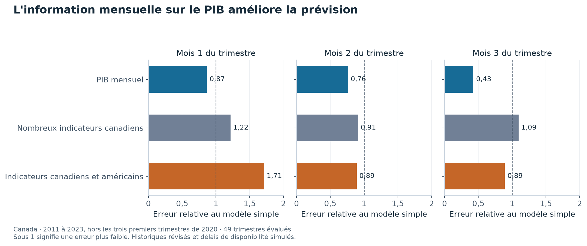

# Estimer la croissance du Canada avant la publication du chiffre officiel

L'activité économique du trimestre en cours n'est pas encore connue lorsque les entreprises et les banques doivent décider. Le produit intérieur brut, ou PIB, mesure la valeur de la production. Son chiffre officiel arrive avec retard.

Ce projet estime la croissance canadienne en utilisant les informations déjà publiées selon un calendrier simplifié. Il compare une règle fondée sur le passé du PIB à des modèles qui ajoutent des données mensuelles.

**Le PIB mensuel aide davantage que le grand ensemble d'indicateurs dans ce test.** Le résultat porte sur les prévisions de 2011 à 2023.

## Davantage de données ne signifie pas toujours moins d'erreur

| Informations utilisées | Erreur au premier mois | Erreur au troisième mois |
|---|---:|---:|
| Passé du PIB seul, référence | 1,00 | 1,00 |
| PIB mensuel ajouté | 0,87 | 0,43 |
| Grand ensemble d'indicateurs canadiens | 1,22 | 1,09 |
| Indicateurs canadiens et américains | 1,71 | 0,89 |

L'erreur de la référence est ramenée à 1. Une valeur de 0,43 signifie une erreur **57 % plus faible**. Cette mesure donne davantage de poids aux grosses erreurs. Les trois premiers trimestres de 2020 sont retirés de ce tableau pour éviter qu'ils dominent toute la comparaison. [Données du tableau](results/tables/rmsfe_hors_covid.csv).



Les barres comparent les modèles aux trois dates de prévision. Sous la ligne de référence, l'erreur est plus faible. L'arrivée des données de PIB mensuel améliore nettement la prévision au fil du trimestre.

## Comment prévoir un trimestre incomplet

Le programme produit une estimation à la fin de chacun des trois mois. Il prolonge les mois de PIB encore inconnus, puis relie les chiffres mensuels à la croissance trimestrielle.

Les autres modèles utilisent aussi des indicateurs économiques, résumés ou sélectionnés automatiquement. Tous respectent les délais imposés par le protocole.

## Une limite importante du test historique

Les délais sont simulés, mais les valeurs économiques sont celles d'historiques révisés. Ce n'est donc pas une reconstitution exacte de tout ce qu'un prévisionniste savait à l'époque.

Le résultat ne reproduit pas à l'identique le modèle dynamique de Chernis et Sekkel. Il compare les méthodes effectivement présentes dans ce dépôt. Les résultats avec la pandémie incluse restent dans la [table complète](results/tables/rmsfe.csv).

## Refaire les calculs

```bash
uv sync --locked --all-extras
uv run ncc fetch
uv run ncc report
uv run pytest
```

Le test historique complet utilise `uv run ncc backtest` après dépôt manuel des fichiers LCDMA et FRED-MD décrit dans l'étude détaillée. Le rapport courant n'a pas besoin de ces fichiers. Le graphique de présentation se régénère hors réseau avec `uv run python scripts/figure_presentation.py`, depuis les tableaux publiés.

## Pour aller plus loin

[Méthodes, résultats complets et références](docs/ETUDE_DETAILLEE.md) · [Présentation en PDF](rapport/rapport.pdf) · [Citer le projet](CITATION.cff) · [Licence](LICENSE).

## English summary

Monthly GDP improves Canadian growth estimates in this pseudo real-time comparison. Revised data and simplified publication lags limit historical realism. The main table excludes the first three quarters of 2020.
