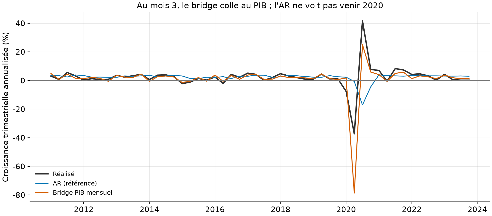
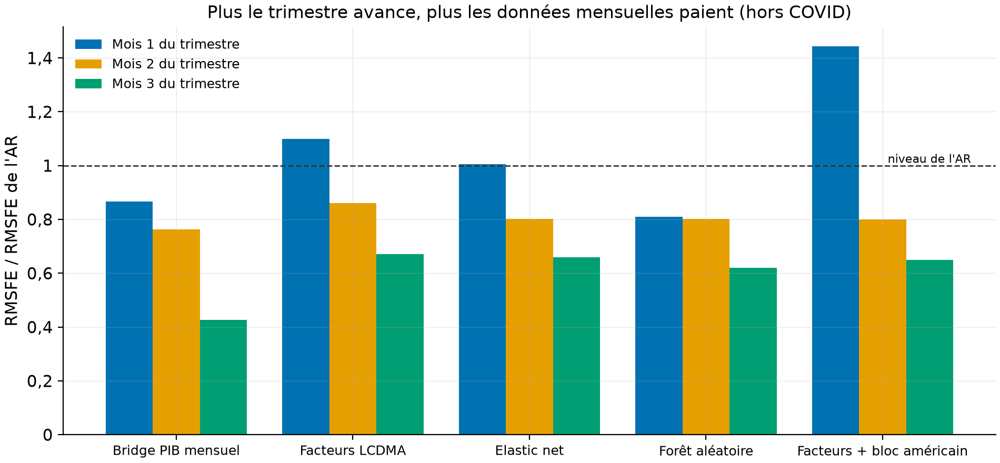
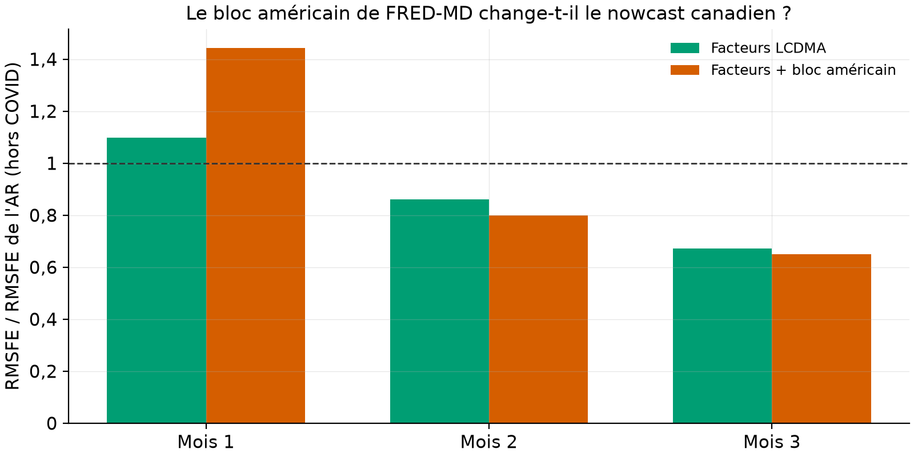

# Nowcaster le PIB canadien : le pont mensuel bat l'autorégression, le bloc américain n'ajoute rien

Le PIB trimestriel canadien arrive avec deux mois de retard ; ce dépôt le prévoit pendant le
trimestre même, avec l'information réellement disponible à chaque date, et mesure qui de
l'autorégression, du PIB mensuel, des 400 séries de la LCDMA ou de l'apprentissage machine fait le
meilleur travail.

[](https://github.com/Guilou001/07-nowcast-canada/actions/workflows/ci.yml)


**Résultat en une phrase.** Sur 52 trimestres hors échantillon (2011-2023), le modèle bridge, la
simple agrégation du PIB mensuel par industrie, **réduit l'erreur de prévision de 57 % par rapport à
l'autorégression au troisième mois du trimestre** (ratio de RMSFE 0,43, p de Diebold-Mariano 0,027,
hors COVID) ; les 400 séries de la LCDMA et la forêt aléatoire font moins bien que ce pont, et le
bloc américain de FRED-MD n'apporte rien, il dégrade même le premier mois (ratio 1,44 contre 1,10).

*English summary.* Pseudo real-time nowcasting of Canadian quarterly GDP growth, 2011-2023, with
publication lags enforced at every date: an AR benchmark, a monthly-GDP bridge, principal-component
factors from the LCDMA panel (400+ Canadian series), elastic net and random forest, plus a US-block
test with FRED-MD factors. Measured verdict: the humble bridge cuts RMSFE by 57 % versus the AR by
month 3 (ratio 0.43, DM p = 0.027, ex-COVID); factor and machine-learning models help less, and the
US block adds nothing (it hurts in month 1). A `ncc report` command produces the current-quarter
nowcast from fresh Statistics Canada data.

## 1. La question posée

Un nowcast, une prévision du trimestre EN COURS faite avant sa publication officielle, est le pain
quotidien des banques centrales : la Banque du Canada décide en octobre avec un PIB officiel arrêté
en juin. En mots simples : peut-on deviner la croissance du trimestre où l'on se trouve, en
n'utilisant que ce qui est déjà publié, et qu'est-ce qui aide le plus, le passé du PIB lui-même, le
PIB mensuel par industrie, un grand panel de 400 indicateurs, ou des modèles d'apprentissage
machine ? Et la question de Chernis et Sekkel (2017), reposée dix ans plus tard : les données
américaines améliorent-elles le nowcast canadien ?

## 2. D'où vient le projet, et ce qu'il apporte

Le nowcasting moderne date de Giannone, Reichlin et Small (2008) ; pour le Canada, Chernis et
Sekkel (2017) ont montré qu'un modèle à facteurs dynamiques battait les références et que le bloc
américain aidait. Le panel utilisé ici est la LCDMA (Fortin-Gagnon, Leroux, Stevanovic et
Surprenant, 2022), le grand panel mensuel canadien, et son pendant américain FRED-MD (McCracken et
Ng, 2016). Ce que ce dépôt apporte :

- **Les délais de publication imposés partout.** À chaque date de nowcast, chaque modèle ne voit
  que le panel arrêté deux mois plus tôt et le dernier PIB réellement publié à cette date ; un test
  choque les mois postérieurs à la coupure et vérifie qu'aucune prévision ne bouge.
- **La même table d'information pour tous les modèles**, du plus simple au plus riche : la
  comparaison mesure l'apport des données et des méthodes, pas des différences de protocole.
- **Des verdicts mesurés qui contrarient l'intuition** : le pont mensuel bat le panel de 400 séries,
  et le bloc américain n'apporte rien sur ce protocole, contrairement au résultat de 2017.
- **Un nowcast du trimestre en cours régénérable en une commande**, sur données fraîches de l'API
  de Statistique Canada.

## 3. Les données, leurs délais, leurs licences

| Source | Contenu | Délai imposé | Licence et accès |
|---|---|---|---|
| Statistique Canada, table 36-10-0104 (v62305752) | PIB trimestriel réel, prix du marché, enchaîné 2017, désaisonnalisé au taux annuel : la cible | publié 2 mois après la fin du trimestre | licence ouverte, API, `ncc fetch` |
| Statistique Canada, table 36-10-0434 (v65201210) | PIB mensuel réel par industrie, depuis 1997 | 2 mois | licence ouverte, API, `ncc fetch` |
| LCDMA (CAN-MD) | 411 séries mensuelles canadiennes depuis 1981 | 2 mois, uniforme et conservateur (déclaré) | non commerciale : dépôt MANUEL dans `data/raw/`, jamais commité ; millésimes publics sur [Borealis](https://borealisdata.ca/dataset.xhtml?persistentId=doi:10.5683/SP3/59JYPU) jusqu'en 2021-08 ; snapshot utilisé arrêté à 2024-04, date dans le nom du fichier |
| FRED-MD | 126 séries mensuelles américaines | 2 mois | dépôt manuel, snapshot 2024-05 |

La cible est la croissance trimestrielle annualisée en pourcent, la convention nord-américaine :
+2 % signifie « si ce rythme durait un an, le PIB gagnerait 2 % ». Le millésime du PIB est le
millésime FINAL, pas celui de l'époque : le protocole est un pseudo temps réel (délais respectés,
révisions non modélisées), la différence avec le vrai temps réel est déclarée en limites.

## 4. La méthode, pas à pas

Chaque trimestre T est nowcasté trois fois : à la fin de son mois 1, de son mois 2 et de son mois
3. À chaque date, l'ensemble d'information contient le panel mensuel arrêté deux mois plus tôt, et
le dernier trimestre de PIB publié (T-2 au mois 1, T-1 ensuite). Fenêtre extensible : tout se
réestime à chaque date, l'évaluation commence en 2011T1. Les cinq modèles :

1. **AR**, l'autorégression : le PIB expliqué par ses deux derniers trimestres publiés. C'est la
   référence à battre, et elle est difficile à battre au mois 1.
2. **Bridge** : le PIB mensuel par industrie, moyenné par trimestre (les mois manquants prolongés
   par une autorégression mensuelle), puis converti en croissance trimestrielle ; une régression
   relie cette croissance mensuelle agrégée à la cible.
3. **Facteurs** : les dix composantes principales de la LCDMA, les quelques forces communes qui
   résument le panel, moyennées sur les trois derniers mois disponibles, plus le bridge et le
   dernier PIB connu, dans une régression linéaire.
4. **Elastic net** : la même table de traits, avec une pénalité qui rétrécit les coefficients
   inutiles, choisie par validation croisée temporelle dans la fenêtre d'entraînement.
5. **Forêt aléatoire** : la même table, sans hypothèse de linéarité (500 arbres, réglages fixes).

La variante « facteurs + bloc américain » ajoute cinq composantes principales de FRED-MD : c'est le
test de Chernis et Sekkel. Le juge est le RMSFE, la racine de l'erreur quadratique moyenne de
prévision, en ratio sur celle de l'AR (moins de 1 = mieux que l'AR), avec le test de
Diebold-Mariano, qui dit si l'écart entre deux modèles dépasse ce que le hasard produirait.

## 5. Les résultats : le pont mensuel gagne, le panel et le bloc américain déçoivent (mesuré)

Tous les chiffres viennent de `results/tables/rmsfe_hors_covid.csv` et `rmsfe.csv`, régénérés par
`uv run ncc backtest` ; 52 trimestres, 936 nowcasts, hors COVID = sans 2020T1 à 2020T3.

| Modèle | Mois 1 | Mois 2 | Mois 3 | p DM (mois 3) |
|---|---:|---:|---:|---:|
| Bridge PIB mensuel | 0,87 | 0,76 | **0,43** | **0,027** |
| Forêt aléatoire | 0,81 | 0,80 | 0,62 | 0,040 |
| Elastic net | 1,01 | 0,80 | 0,66 | 0,086 |
| Facteurs LCDMA | 1,10 | 0,86 | 0,67 | 0,210 |
| Facteurs + bloc américain | 1,44 | 0,80 | 0,65 | 0,199 |

Comment lire ce tableau, en trois constats (les cellules sont des ratios de RMSFE sur l'AR, hors
COVID). D'abord, l'information mensuelle paie de plus en plus au fil du trimestre : au mois 1,
seuls la forêt et le bridge grattent 13 à 19 % d'erreur, et rien n'est significatif ; au mois 3, le
bridge enlève 57 % de l'erreur de l'AR (1,24 point de croissance annualisée contre 2,90, mesuré
dans le même fichier) et c'est statistiquement net. Ensuite, la sophistication ne paie pas ici :
le panel de 400 séries, l'elastic net et la forêt restent DERRIÈRE le simple pont du PIB mensuel,
qui contient déjà l'essentiel du signal, en cohérence avec la leçon des autres dépôts du portfolio.
Enfin, le bloc américain n'aide pas : il dégrade nettement le mois 1 (1,44 contre 1,10, la
composante américaine ajoute du bruit quand l'information canadienne est rare) et ne change
presque rien ensuite ; le gain de Chernis et Sekkel (2017), obtenu en vrai temps réel avec un
modèle à facteurs dynamiques, ne se retrouve pas sur ce protocole, et l'écart de protocole est
déclaré plutôt que masqué.



Comment lire cette figure : le trait noir est la croissance réalisée, les deux courbes les
nowcasts du mois 3 ; la courbe bleue (AR) rate 2020 dans les deux sens, d'abord aveugle à la chute
puis aveugle au rebond, tandis que le bridge (vermillon) suit la chute et le rebond, en les
amplifiant : au 2020T2 (réalisé −37,3 % annualisé), le bridge dit −78,7 et l'AR −0,7. La forêt
aléatoire, absente de la figure, dit −3,2 : un modèle d'arbres ne peut pas prédire en dehors de la
plage qu'il a vue à l'entraînement, et 2020 était hors de toute plage.



Comment lire cette figure : chaque groupe de barres est un modèle, chaque barre un mois du
trimestre, la hauteur le ratio de RMSFE sur l'AR hors COVID ; sous la ligne pointillée, le modèle
bat l'AR. Toutes les barres descendent du mois 1 au mois 3 : c'est l'arrivée des données mensuelles
qui crée le nowcast, pas la méthode.



Comment lire cette figure : à chaque mois du trimestre, la barre verte est le modèle à facteurs
canadien, la vermillon le même modèle avec cinq facteurs américains de FRED-MD en plus. La barre
vermillon ne passe clairement sous la verte à aucun mois, et la dépasse largement au mois 1 : sur
ce protocole, le bloc américain n'apporte rien que le panel canadien n'ait déjà.

Avec la COVID incluse (`rmsfe.csv`), tous les ratios s'écrasent (0,28 à 0,35 au mois 2) : trois
trimestres extrêmes dominent toute somme de carrés, c'est précisément pourquoi les deux tableaux
sont publiés.

## 6. Le nowcast du trimestre en cours, en une commande

`uv run ncc report` interroge l'API de Statistique Canada et produit le nowcast du trimestre en
cours par l'AR et le bridge (les deux modèles qui ne demandent aucun dépôt manuel). Sortie du
28 août 2026, mesurée : trimestre visé 2026T3, information du mois 2, **bridge +2,2 %** et AR
+3,0 % en taux annualisé, dernier trimestre publié 2026T2 à +3,3 %.

## 7. Reproduire

```bash
uv sync --locked --all-extras     # environnement verrouillé (Python 3.12, scikit-learn, pandas 3)
uv run pytest                     # 6 tests synthétiques, sans réseau (calendrier, AR, bridge, fuite, DM)
uv run ncc fetch                  # PIB trimestriel et mensuel par l'API de Statistique Canada
# déposer CAN_MD (LCDMA) et FRED-MD dans data/raw/ (voir section 3, licences non commerciales)
uv run ncc backtest               # 936 nowcasts, tables + 3 figures (35 s mesurées)
uv run ncc report                 # le nowcast du trimestre en cours (PIB seulement, sans dépôt manuel)
```

## 8. Limites, avec leur statut

| Limite | Statut |
|---|---|
| Pseudo temps réel : délais de publication imposés, mais millésime FINAL du PIB et du panel (les révisions ne sont pas modélisées) ; les vrais millésimes LCDMA 2019-2021 de Borealis permettraient une évaluation en vrai temps réel | déclaré ; extension naturelle |
| Le snapshot LCDMA s'arrête en 2024-04, l'évaluation en 2023T4 ; le nowcast courant (section 6) n'utilise que l'API | mesuré et déclaré |
| Délai uniforme de 2 mois pour tout le panel, conservateur (l'emploi sort à 1 mois, les marchés à 0) : le vrai calendrier série par série affinerait les mois 1 et 2 | choix déclaré |
| Pas de modèle à facteurs dynamiques à fréquences mixtes (le DFM de Chernis-Sekkel) : la comparaison avec leur résultat est indicative, pas une réplication | reconnu ; c'est la suite logique du dépôt |
| Stationnarisation de la LCDMA par une règle simple (différence de log si positif, différence sinon) au lieu des codes officiels du fichier de description | approximation déclarée |
| La cible est le PIB aux prix du marché (dépenses) alors que le bridge agrège le PIB par industrie (production) : l'écart conceptuel entre les deux mesures est ignoré | reconnu, standard dans la littérature bridge |

## 9. Crédits, licence, citation

Giannone, D., Reichlin, L. et Small, D. (2008), « Nowcasting: The real-time informational content
of macroeconomic data » ; Chernis, T. et Sekkel, R. (2017), « A dynamic factor model for nowcasting
Canadian GDP growth » ; Fortin-Gagnon, O., Leroux, M., Stevanovic, D. et Surprenant, S. (2022),
« A large Canadian database for macroeconomic analysis » ; McCracken, M. et Ng, S. (2016),
« FRED-MD » ; Diebold, F. et Mariano, R. (1995) ; Harvey, D., Leybourne, S. et Newbold, P. (1997).
Données : Statistique Canada (licence ouverte), LCDMA et FRED-MD (non commerciales, jamais
redistribuées ici). Code : Guillaume Vaudescal, 2026, licence MIT.
